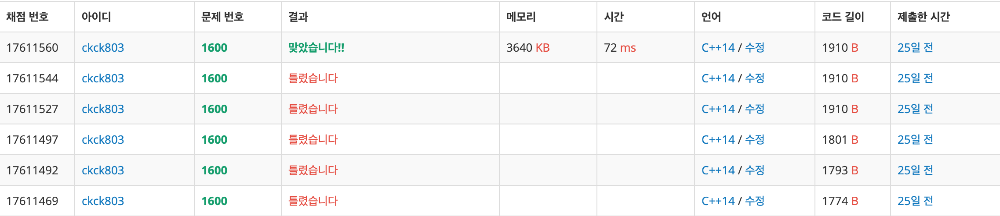

# 백준 1600 - 말이 되고픈 원숭이

## 링크

https://www.acmicpc.net/problem/1600

## 체점 현황


## 문제 풀이
1. 말처럼 뛸 수 있는 횟수(k), width, height를 입력 받는다.
2. field에 대한 정보를 입력 받는다.
3. (0, 0)에서 시작해 (width-1, height-1)까지 갈 수 있는 최소 횟수를 탐색한다.
   1. 원숭이가 움직일 수 있는 방법은 두가지가 존재한다.
   2. 말처럼 뛸 수 있는 방법(k내의 횟수에서)
   3. 상하좌우로 움직일 수 있는 방법
   4. 말이 (width-1, height-1)에 도착하면 그 횟수를 반환한다. 만약 도착하지 못할 경우 -1을 반환한다.
4. 말이 움직인 횟수를 출력해준다.


## 전체 소스 코드
```cpp
#include <bits/stdc++.h>
using namespace std;

int numOfKnight;
int width, height;

int field[202][202];
bool check[31][202][202];

int dx[4] = {1, -1, 0, 0};
int dy[4] = {0, 0, 1, -1};
int horse_dx[8] = {1, 2, 2, 1, -1, -2, -2, -1};
int horse_dy[8] = {2, 1, -1, -2, -2, -1, 1, 2};

struct point {
    int k;
    int y;
    int x;
};

int bfs(int y, int x) {
    check[0][y][x] = true;
    queue<point> q;
    q.push({0, y, x});
    int count = 0;

    while (!q.empty()) {
        int q_size = q.size();
        while (q_size--) {
            int cntK = q.front().k;
            int cntY = q.front().y;
            int cntX = q.front().x;
            q.pop();

            if (cntY == height - 1 && cntX == width - 1) {
                return count;
            }

            if (cntK < numOfKnight) {
                for (int i = 0; i < 8; i++) {
                    int ny = cntY + horse_dy[i];
                    int nx = cntX + horse_dx[i];

                    if (0 > ny || ny >= height || 0 > nx || nx >= width)
                        continue;
                    if (field[ny][nx] == 0 && check[cntK + 1][ny][nx] == false) {
                        check[cntK + 1][ny][nx] = true;
                        q.push({cntK + 1, ny, nx});
                    }
                }
            }

            for (int i = 0; i < 4; i++) {
                int ny = cntY + dy[i];
                int nx = cntX + dx[i];

                if (0 > ny || ny >= height || 0 > nx || nx >= width)
                    continue;
                if (field[ny][nx] == 0 && check[cntK][ny][nx] == false) {
                    check[cntK][ny][nx] = true;
                    q.push({cntK, ny, nx});
                }
            }
        }
        count++;
    }

    return -1;
}

int main(void) {
    cin >> numOfKnight >> width >> height;

    for (int i = 0; i < height; i++) {
        for (int j = 0; j < width; j++) {
            cin >> field[i][j];
        }
    }

    int minValueOfMove = bfs(0, 0);
    cout << minValueOfMove << '\n';
    return 0;
}
```