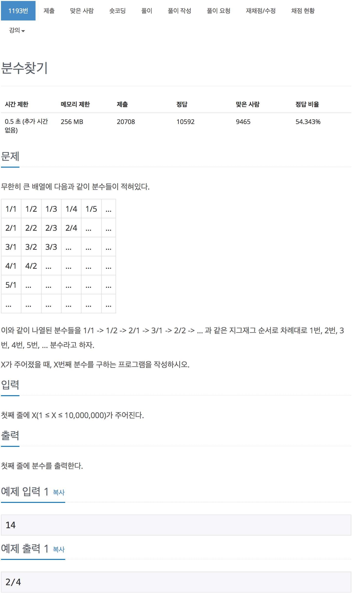

# 백준 1193 - 분수 찾기

[1193 - 분수 찾기](https://www.acmicpc.net/problem/1193)


```cpp
#include <iostream>
using namespace std;

int n;
int sum;

int find_num()
{
    int i = 1;
    while (n > sum)
    {
        sum += i;
        i++;
    }
    sum -= --i;
    return i;
}

int main(void)
{
    // a는 분자, b는 분모
    int a, b;
    cin >> n;
    int num = find_num();
    // 해당 행의 몇번째 열에 있는지 찾기 위해서
    int size = n - sum;

    // 짝수일 때
    // 분자는 커지고
    // 분모는 작어진다.
    if (num % 2 == 0)
    {
        a = 0;
        b = num + 1;
        for (int i = 0; i < size; i++)
        {
            a++;
            b--;
        }
    }
    else
    {
        a = num + 1;
        b = 0;
        for (int i = 0; i < size; i++)
        {
            a--;
            b++;
        }
    }

    cout << a << "/" << b << endl;
}
```
