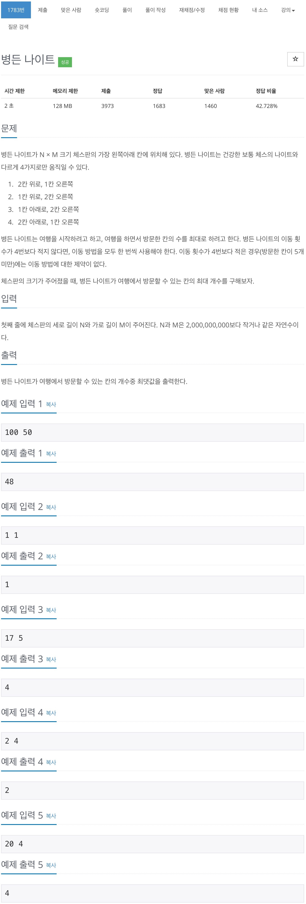

# 백준 - 1783 병든 나이트



## 채점 현황


## 풀이 방법

손으로 그려가면서 풀었으면 `틀렸습니다.`가 더 조금 나왔을 텐데,  
굳이.... 머리로만 풀어서 `틀렸습니다.`를 왕창 받았다.

### 문제 조건

- 2칸 위로, 1칸 오른쪽
- 1칸 위로, 2칸 오른쪽
- 1칸 아래로, 2칸 오른쪽
- 2칸 아래로, 1칸 오른쪽

주어진 4가지의 조건을 최소한 한번씩 사용할 수 있는 체스판인지 확인해야 한다.  
세로가 3이상, 가로가 7이상인 경우부터 위의 4가지 조건을 최소한 한번씩 사용할 수 있는 체스판이다.  
만약, 주어진 4가지의 조건을 최소한 한번씩 사용할 수 없는 경우에 대해서 제대로 된 예외처리를 해주어야 하며, 머리로만 할 경우 피곤해진다...


## 전체 소스 코드
```cpp
#include <iostream>
#include <vector>
using namespace std;

int n, m;

int main(void) {
    cin >> n >> m;
    if (n == 1 || m == 1) {
        cout << 1 << '\n';
        return 0;
    }

    if (n >= 3) {
        if (m >= 7) {
            cout << m - 2 << '\n';
        } else if (m >= 4) {
            cout << 4 << '\n';
        } else {
            cout << m << '\n';
        }
    } else {
        m--;

        if (m >= 6) {
            cout << 4 << '\n';
        } else if (m >= 2) {
            cout << m / 2 + 1 << '\n';
        } else {
            cout << 1 << '\n';
        }
    }
    return 0;
}
```