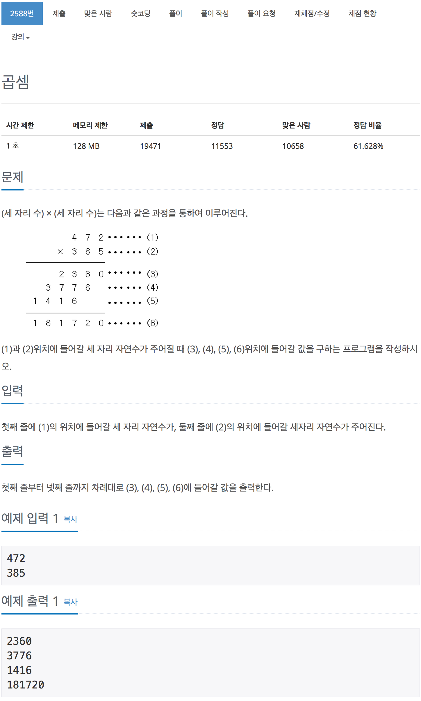

# 백준 2588 - 곱셈

[2588 - 곱셈](https://www.acmicpc.net/problem/2588)


```cpp
#include <iostream>
#include <vector>
using namespace std;

int n, m;
vector<int> v;

int main(void)
{
    scanf("%d %d", &n, &m);

    int ins = m;
    while (ins > 0)
    {
        int temp = ins % 10;
        v.push_back(n * temp);
        ins /= 10;
    }

    int size = v.size();
    for (int i = 0; i < size; i++)
    {
        printf("%d\n", v[i]);
    }
    printf("%d\n", n * m);
    return 0;
}
```
